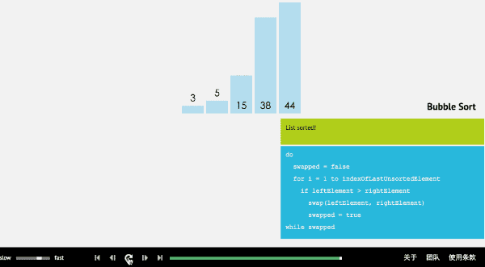

# 第一次社招面试

@(主要是C++开发的面试，会加上我的一些个人理解)

[C++基础参考：https://juejin.im/entry/5a1bbb386fb9a0451c3a1e0f?from=singlemessage ]

[数据库基础参考：https://juejin.im/post/5a9ca0d6518825555c1d1acd ]

[网络 TCP/IP：https://juejin.im/post/586cfcf8da2f600055ce8a8d ]

- **语法特性**：主要是一些特性注意点，工作中用的不多或者就是默认使用，但面试就是喜欢搞这些花里胡哨的东西； 
- **数据库** ：这部分不多，就是语法使用；
- **算法数据结构** ：排序算法和常用的数据结构；
- **网络操作系统** ：TCP，UDP，进程线程等；
- **编程题** ：手撕代码；
- **Linux**：Linux，少。

-------------------

## 目录  
- [语法特性](#语法特性)
	- [STL中vector自动增长的原理](#STL中vector自动增长的原理)
	- [STL中map原理（如何实现快速插入和快速查询）](#STL中map原理（如何实现快速插入和快速查询）)
	- [重写（override）和重载（overload）](#重写（override）和重载（overload）)
	- [面向对象三大特性：封装，继承，多态](#面向对象三大特性：封装，继承，多态)
	- [C++11特性介绍](#C++11特性介绍)
	- [智能指针的理解](#智能指针的理解)
	- [构造函数的执行顺序](#构造函数的执行顺序)
	- [构造函数和析构函数能否为虚](#构造函数和析构函数能否为虚)
	- [构造函数和析构函数能否调用虚函数](#构造函数和析构函数能否调用虚函数)
	- [虚函数表的作用](#虚函数表的作用)
	- [四种强制类型转换](#四种强制类型转换)
	- [类中拷贝构造函数的形参为什么要为引用](#类中拷贝构造函数的形参为什么要为引用)
	- [某些重载运算符为什么要返回引用](#某些重载运算符为什么要返回引用)
	- [空类](#空类)
	- [构造函数为什么没有返回值](#构造函数为什么没有返回值)
	- [深拷贝和浅拷贝](#深拷贝和浅拷贝)
	- [动态类型转换和静态类型转换](#动态类型转换和静态类型转换)
	- [动态库和静态库](#动态库和静态库)
	- [构造函数中成员变量一定要通过初始化列表初始化](#构造函数中成员变量一定要通过初始化列表初始化)
	- [函数返回值为左值](#函数返回值为左值)
	- [malloc和new区别](#malloc和new区别)
	- [malloc在子函数的问题](#malloc在子函数的问题)
	- [宏定义最小值函数](#宏定义最小值函数)
	- [函数式编程](#函数式编程)
	- [编程中的踩的坑](#编程中的踩的坑)
- [数据库](#数据库)  
	- [数据库的三大范式加BCNF](#数据库的三大范式加BCNF)
	- [数据库连接池](#数据库连接池)
	- [where，group by和having使用](#where，group by和having使用)
	- [distinct用法](#distinct用法)
	- [索引使用，效率对比](#索引使用，效率对比)
	- [查询和编号为01的同学学习的课程完全相同的其他同学](#查询和编号为01的同学学习的课程完全相同的其他同学)
	- [查询某课程成绩在第三名到第六名同学的成绩](#查询某课程成绩在第三名到第六名同学的成绩)
- [算法数据结构](#算法数据结构) 
	- [八大排序（算法，复杂度，稳定性）](#八大排序（算法，复杂度，稳定性）)
	- [二叉查找树（B树）和红黑树](#二叉查找树（B树）和红黑树)
	- [大小堆，优先队列](#大小堆，优先队列)
	- [先序，中序，后序遍历](#先序，中序，后序遍历)
	- [手动实现栈结构](#手动实现栈结构)
	- [常用的设计模式](#常用的设计模式)
	- [常见的数据结构](#常见的数据结构)
- [网络操作系统](#网络操作系统) 
	- [进程，线程，协程](#进程，线程，协程)
	- [线程池](#线程池)
	- [进程间通信](#进程间通信)
	- [线程间同步(或互斥)](#线程间同步(或互斥))
	- [死锁](#死锁)
	- [select，poll，epoll比较](#select，poll，epoll比较)
	- [socket编程](#socket编程)
	- [TCP和UDP](#TCP和UDP)
	- [OSI七层模型与TCP/IP五层模型及协议](#OSI七层模型与TCP/IP五层模型及协议)
	- [TCP粘包与分包](#TCP粘包与分包)
- [编程题](#编程题) 
	- [不用循环，goto和递归，从1打印到100](#不用循环，goto和递归，从1打印到100)
	- [求不超过1000的回文素数（回文数：左右对称且大于10）](#求不超过1000的回文素数（回文数：左右对称且大于10）)
	- [100个数，1到99存在一个重复，如何查找重复数](#100个数，1到99存在一个重复，如何查找重复数)
	- [数组中第二大数](#数组中第二大数)
	- [二分查找](#二分查找)
- [其他（Linux）](#其他)  
	- [Linux常用的命令和信号](#Linux常用的命令和信号)
	- [linux下GDB代码调试](#linux下GDB代码调试)
	

## 语法特性
> ### STL中vector自动增长的原理

  1. 发现空间不足，重新申请一块更大的内存(成倍增长)
  2. 将旧空间的数据拷贝新空间
  3. 旧空间释放掉 
  4. 将新元素插入到新空间中
 
参考：https://blog.csdn.net/u010259177/article/details/82849876

> ### STL中map原理（如何实现快速插入和快速查询）

- map内部自建一颗红黑树(一种非严格意义上的平衡二叉树)，这颗树具有对数据自动排序的功能，所以在map内部所有的数据都是有序的，而插入删除等操作都可以在O(log n)时间内完成。

参考：https://blog.csdn.net/lsh_2013/article/details/46762505

> ### 重写（override）和重载（overload）

1. 重写（override）
override是重写（覆盖）了一个方法，以实现不同的功能。一般是用于子类在继承父类时，重写（重新实现）父类中的方法。多态的关键！
2. 重载（overload）
overload一般是用于在一个类内实现若干重载的方法，这些方法的名称相同而参数形式不同。

参考：https://www.cnblogs.com/yaobolove/p/4474818.html

> ### 面向对象三大特性：封装，继承，多态

1. 封装：将一类事物所共有的属性和行为方法进行总结，封装在一个类中
2. 继承是把一个已经成型（封装好）的类继承到一个新形成的类中，一般将被继承的类称为父类（基类），主动继承的称为子类（派生类）
3. 多态：
	什么是多态：
	调用相同的接口，表现出不同的结果。
	如何实现多态：
	通过定义和重写虚函数，通过基类的指针或引用指向派生类对象，通过基类的指针或引用调用虚函数，实现接口的高度统一。简而言之就是调用相同的接口表现不同的结果。 

参考： https://blog.csdn.net/CC_clear/article/details/76551311?utm_source=blogxgwz3

> ### C++11特性介绍

- 空指针：nullptr
- 类型推导 ：auto 和 decltype
- 区间迭代：or(auto &i : array)
- Lambda 表达式
- 正则表达式

参考：https://blog.csdn.net/jiange_zh/article/details/79356417

> ### 智能指针的理解

- 智能指针是为了更容易的动态的管理和使用动态内存而设计的
	1. auto_ptr：利用特点“栈上对象在离开作用范围时会自动析构”
	2. shared_ptr：每一个shared_ptr都有一个与之相关联的计数器称为引用计数器
	3. unique_ptr： 独占所指向的对象
	4. weak_ptr：他是一种弱引用 指向shared_ptr所指向的对象

参考：https://www.cnblogs.com/KillerAery/p/9096558.html

> ### 构造函数的执行顺序

1. 虚拟基类的构造函数（多个虚拟基类则按照继承的顺序执行构造函数）。
2. 基类的构造函数（多个普通基类也按照继承的顺序执行构造函数）。
3. 类类型的成员对象的构造函数（按照初始化顺序）。
4. 派生类自己的构造函数。

> ### 构造函数和析构函数能否为虚

- 构造函数不能为虚函数，而析构函数可以且常常是虚函数

参考：https://blog.csdn.net/leigelaile1/article/details/80430822

> ### 构造函数和析构函数能否调用虚函数

- 构造函数不可以实现动态联编，原因是构造函数调用时对象并没有实例化，而虚函数表并没有在对象中生成，只能调用本类的。
- 析构函数也不可以实现动态联编，原因是如果调用虚函数析构函数会调用一直调用对应对象的虚函数，比如子类的，在调用完子类的析构函数后调用基类的析构函数此时子类处理已经结束了。

参考：https://www.cnblogs.com/vincently/p/4754206.html

> ### 虚函数表的作用

- 虚函数（Virtual Function）是通过一张虚函数表（Virtual Table）来实现的。简称为V-Table。在这个表中，主是要一个类的虚函数的地址表，这张表解决了继承、覆盖的问题，保证其容真实反应实际的函数。这样，在有虚函数的类的实例中这个表被分配在了这个实例的内存中，所以，当我们用父类的指针来操作一个子类的时候，这张虚函数表就显得由为重要了，它就像一个地图一样，指明了实际所应该调用的函数。

参考：https://blog.csdn.net/yc461515457/article/details/52658589

虚函数表的实现和用C语言模拟 ：https://blog.csdn.net/yc461515457/article/details/52658589

> ### 四种强制类型转换

1. static_cast：可以实现c++中内置基本数据类型之间相互转换 ，在编译期
2. const_cast：其操作不能在不同的种类间转换，相反，它仅仅能把它作用的表达式，转换常量。它可以使一个本来不是const的类型转换成const类型。，或者把const属性去掉，在编译期
3. reintepret_cast：它可以转化任何内置的数据类型为其他的任何数据类型，也可以转化任何指针类型为其他类型，甚至可以转化内置的数据类型为指针，无需考虑类型安或常量的情形，在编译期
4. dynamic_cast：只有在派生类之间转换时才使用dynamic_cast，它是运行时处理的，运行时要进行类型检查

参考：https://www.cnblogs.com/0jike/p/4845034.html

> ### 类中拷贝构造函数的形参为什么要为引用

- 拷贝构造函数的时候， 参数为引用，不为值传递是为了防止拷贝构造函数的无限递归，最终导致栈溢出。
- 为什么拷贝构造函数Example(const Example &temp )不能写成Account( const Example temp )？
首先你要明白普通的函数，像这样的Example temp2( temp1 ) ,如果参数不是引用，是会默认调用一次拷贝构造函数的。
所以如果有一个函数Example( const Example temp)，在参数传递的时候要调用拷贝构造函数也就是自己，调用自己的时候又是一次参数传递，所以又要调用一次自己，调用自己的时候又是一次参数传递，所以又要调用一次自己.....

> ### 某些重载运算符为什么要返回引用

- C++赋值运算符的本意为“返回左值的引用”(左值：赋值号左面的变量而非其值)
例如：

```C++
代码在C++可行，C语言不可行
　　int a, b = 3, c = 2;
　　(a = b) = c;
　　cout<<a<<b<<c<<endl;

    结果：232
```

　　对于a = b(a，b均为对象时)，若不返回左值的引用，将会生成临时对象。如果不处理a = b = c这样的表达式，也会正常(只是会调用拷贝构造函数和析构函数处理临时对象)。
**对于(a = b) = c**
首先调用赋值函数给a赋值，然后用c给他的返回值赋值。如果这个返回值是const，当然就不行了。即所谓的左值
另外假如对于对象，a=b=c，类中赋值运算符重载返回的是void时是不能连续赋值的

- 为了进行连续赋值，即 x = y = z
　　1. 赋值返回引用：x = y = z 先执行y = z，返回y的引用，执行x = y
　　2. 赋值不返回引用
　　x = y = z 先执行y = z，返回用y初始化的临时对象(注意临时对象都是常对象)，再执行x = y的临时对象(要求operator=(const X&) )，返回用x初始化的临时对象(此处要求拷贝构造函数必须为X(const X&) )。
　　所以也并非必须返回引用，返回引用的好处既可以于赋值的原始语义已知，又可避免拷贝构造函数和析构函数的调用。

参考：https://www.cnblogs.com/codingmengmeng/p/5871254.html

> ### 空类

- 对于空类～
对于空类声明时，编译器不会生成任何的成员函数，只会生成1个字节的占位符
定义空类，定义时会生成6个成员函数
当空类Empty_one定义一个对象时Empty_one pt，sizeof(pt)仍是为1，但编译器会生成6个成员函数：一个缺省的构造函数、一个拷贝构造函数、一个析构函数、一个赋值运算符、两个取址运算符。
```C++
class Empty
{};

等价于：
class Empty
{
public:
Empty(); //缺省构造函数
Empty(const Empty &rhs); //拷贝构造函数
~Empty(); //析构函数 
Empty& operator=(const Empty &rhs); //赋值运算符
Empty* operator&(); //取址运算符
const Empty* operator&() const; //取址运算符(const版本)
};
```

> ### 构造函数为什么没有返回值

- 构造函数的调用之所以不设返回值，是因为构造函数的特殊性决定的。从基本语义角度来讲，构造函数返回的应当是所构造的对象。否则，我们将无法使用临时对象。也容易产生二义性：
```
某构造函数为：int Test()
void foo(int a) {...} 
void foo(const Test& a) {...}
foo(Test()); //究竟调用谁？
```

> ### 深拷贝和浅拷贝

- 浅拷贝：使用默认拷贝构造函数，增加了一个指针，指向原来已经存在的内存，复制双方相互影响，并且析构的时候，同一块内存空间会被析构两次，在第二次析构时会发生错误
- 深拷贝：使用自定义拷贝构造函数，增加了一个指针，并新开辟了一块空间，复制双方相互不影响

参考：https://blog.csdn.net/caoshangpa/article/details/79226270

> ### 动态类型转换和静态类型转换

- 对应的就是static_cast和dynamic_cast
- 需要注意的就是动态类型转换作用于运行期，静态类型转换作用于编译期；
- 静态转换用于，普通数据类型间的转换，具有继承关系的父子类指针或引用的转换；父子类间转换存在两种形式的转换，即上行转换（子类到父类）和下行转换（父类到子类）。对于static_cast，上行转换时安全的，而下行转换时不安全的，但可行
- 动态类型转换会对转换的数据类型进行检查，动态类型转换不支持基础数据类型间的转换，不支持无继承关系的两个类型之间的指针或引用转换，对于有继承关系的两个类，只支持向上转换（子类转父类），不支持向下转换（父类转子类）

> ### 动态库和静态库

- 静态库和动态库差异点：
	1. 静态库：链接时完整地拷贝至可执行文件中，被多次使用就有多份冗余拷贝。
	2 .动态库：链接时不复制，程序运行时由系统动态加载到内存，供程序调用，系统只加载一次，多个程序可以共用，节省内存。
- 共同点：
	静态库和动态库都是闭源库，只能拿来满足某个功能的使用，不会暴露内部具体的代码信息，而从github上下载的第三方库大多是开源库

参考：https://www.cnblogs.com/striveLD/p/5752010.html

> ### 构造函数中成员变量一定要通过初始化列表初始化

1. 类成员为const类型
2. 类成员为引用类型

> ### 函数返回值为左值

```C++
#include <iostream>  
using namespace std;  
  
class A {
private:
	int i;
public:
	A(){i=0;}
	int & get(){
		return i;
	}
};
 
void main(){
	A a;
	cout<<a.get()<<endl; //数据成员值为0
	a.get()=1; //尝试修改a对象的数据成员为1，而且是用函数调用表达式作为左值。
	cout<<a.get()<<endl; //数据成员真的被改为1了，返回指针的情况也可以修改成员i的值，所以为了安全起见最好在返回值加上const，使得函数调用表达式不能作为左值
}
```

> ### malloc和new区别

1. new/delete是C++关键字运算符，需要编译器支持。malloc/free是库函数，需要有头文件支持
2. 使用new操作符申请内存分配时不用指定内存块的大小，编译器会根据类型信息自行计算；而malloc则需要显式地指出所需内存的大小
3. 分配成功：
new操作符内存分配成功时，返回的是对象类型的指针，类型严格与对象匹配，无须进行类型转换，所以new是符合类型安全性的操作符；而malloc内存分配成功则是返回void * ，需要通过强制类型转换将void*指针转换成对应的类型。
4. 分配失败：new内存分配失败时，会抛出bac_alloc异常。malloc分配内存失败时返回NULL。
5. 面向对象：
new会调用perator new函数，申请足够的内存（通常底层使用malloc实现）。然后调用类型的构造函数，并返回对应类型指针。delete先调用析构函数，然后调用operator delete函数释放内存（通常底层使用free实现）。
而malloc/free是库函数，只能动态的申请和释放内存，无法进行构造和析构工作。
6. 重载
C++允许重载new/delete操作符，例如实现内存检测；而malloc不允许重载。
7. 内存区域
new操作符从自由存储区（free store）上为对象动态分配内存空间，而malloc函数从堆上动态分配内存。自由存储区是C++基于new操作符的一个抽象概念，凡是通过new操作符进行内存申请，该内存即为自由存储区。而堆是操作系统中的术语，是操作系统所维护的一块特殊内存，用于程序的内存动态分配，C语言使用malloc从堆上分配内存，使用free释放已分配的对应内存。自由存储区不等于堆，如上所述，布局new就可以不位于堆中。

参考：https://blog.csdn.net/nie19940803/article/details/76358673

> ### malloc在子函数的问题

- malloc函数是为指针变量或数组分配某个可用空间的首地址，所以当分配首地址给一个指针变量时，这个指针变量指向的内容就发生了改变，指向了由malloc分配的那一块空间，即子函数和父函数对应指针不是指向同一块地址了。如果要想改变一个指针变量的指向，在子函数中就要返回这个指针变量的地址
- 解决办法：
	1. 使用二重指针，如：void create(char **str)
	2. 将创建的空间首地址返回，即return 对应指针

参考：http://www.mamicode.com/info-detail-1612302.html

> ### 宏定义最小值函数
```
#define MIN(x,y) ((x)<(y)?(x):(y))
```
- 注意的是：
	1. 变量用（）括起来，防止预处理器展开的错误
```
#define MIN(x,y) (x<y?x:y)
int a=3,b=4,c=5;
MIN(a+b,c) //返回a+b=7 
```
	2. 对于自增自减
```C++
int a=3,b=5;
MIN(a++,c) //返回5,会自增连两次
```

> ### 函数式编程

函数式编程是一种编程范式，它有下面的一些特征：
- 函数是一等公民，可以像数据一样传来传去。
- 高阶函数
- 递归
- pipeline
- 惰性求值
- 柯里化
- 偏应用函数

参考：https://www.cnblogs.com/aademeng/articles/7263514.html

> ### 编程中的踩的坑

- 这个主要就是考究你平时编程多还是少
可以参考：https://blog.csdn.net/gitchat/article/details/78737116

## 数据库

> ### 数据库的三大范式加BCNF

- 概括：
	1. 第一范式～列的原子性
	2. 第二范式～取消部分依赖
	3. 第三范式～取消间接依赖
	4. BCNF～取消主属性对主属性的依赖
- 范式具体理解：
	1. 定义：
第一范式：（1NF）
如果关系模式，它的每一分量是不可分的数据项，则此关系模式为第一范式
第二范式：（2NF）
若关系模式R属于1NF，且每个非主属性完全依赖于码，则R为2NF
第三范式：（3NF）
若关系模式R属于2NF，不存在非主属性对码的传递依赖，则称R为3NF
传递依赖：当属性间存在X->Y,Y-\->X,Y->Z,称z传递依赖与X

	2. 举例
将有关学生简历、选课等数据设计成一关系模式student
表示为：
```sql
student(sno,sname,age,sex,class,department,cno,cname,score,grade)
```
该关系模式的每一属性对应的域为简单域，符合第一范式
该关系模式满足函数依赖集
```sql
F={sno->sname,sno->age,sno->sex,sno->class,sno->department
   class->departmet  (班级决定系)
   cno->cname,cno->score(课程号决定课程名、学分)
   sno,cno->grade(学号和课程号决定成绩）
  }
```
下面将低级范式的关系模式转换成若干个高一级范式的关系模式集合
```sql
student1(sno,sname,age,sex,class,department)

course(cno,cname,score)

sc(sno,cno,grade)
```
非主属性对码完全依赖，均为2NF

分析模式student1,存在sno->class ,class-\->sno,class->department
所以存在department(系)对sno(学号)传递依赖，所以关系模式student1不是第三范式
student1分解为:
```sql
student2(sno,sname,age,sex,class)

class(class,department)
```
所以关系模式student 可分解成 4个3NF的关系模式student2 ,class ,course,sc

> ### 数据库连接池

- 连接复用。通过建立一个数据库连接池以及一套连接使用管理策略，使得一个数据库连接可以得到高效、安全的复用，避免了数据库连接频繁建立、关闭的开销

参考：https://www.cnblogs.com/wym789/p/6374440.html

> ### where，group by和having使用

- where和having比较：
聚合函数是比较where、having 的关键。 
where、聚合函数、having 在from后面的执行顺序：
__where>聚合函数(sum,min,max,avg,count)>having__

- 列出group by来与where和having比较，因where和having 在使用group by时问的最多，where在group by前，having在之后。若须引入聚合函数来对group by 结果进行过滤 则只能用having。
```sql
样例：select sum(score) from student where sex='man' group by name having sum(score)>210
```
注意事项 ： 
1. where 后不能跟聚合函数，因为where执行顺序大于聚合函数。 
2. where 子句的作用是在对查询结果进行分组前，将不符合where条件的行去掉，即在分组之前过滤数据，条件中不能包含聚组函数，使用where条件显示特定的行。where可以对数据库中字段进行过滤。 
3. having 子句的作用是筛选满足条件的组，即在分组之后过滤数据，条件中经常包含聚组函数，使用having 条件显示特定的组，也可以使用多个分组标准进行分组。
4. select是最后执行的
5. having 列出的字段必须要在前面出现过，包括select和group中，但where的是不算的
6. GROUP BY 是分组查询, 一般 GROUP BY 是和聚合函数配合使用
group by 有一个原则,就是 select 后面的所有列中,没有使用聚合函数的列,必须出现在 group by 后面（重要）

> ### distinct用法

- 用于返回唯一不同的值

> ### 索引使用，效率对比

- 什么时候需要创建索引

	1. 表经常进行 SELECT 操作
	2. 表很大(记录超多)，记录内容分布范围很广
	3. 列名经常在 WHERE 子句或连接条件中出现

- 什么时候不需要创建索引
	1. 表经常进行 INSERT/UPDATE/DELETE 操作
	2. 表很小(记录超少)
	3. 列名不经常作为连接条件或出现在 WHERE 子句中

- 索引优缺点：

	1. 索引加快数据库的检索速度
	2. 索引降低了插入、删除、修改等维护任务的速度(虽然索引可以提高查询速度，但是它们也会导致数据库系统更新数据的性能下降，因为大部分数据更新需要同时更新索引)
	3. 唯一索引可以确保每一行数据的唯一性，通过使用索引，可以在查询的过程中使用优化隐藏器，提高系统的性能
	4. 索引需要占物理和数据空间

- 效率 （参考：https://blog.csdn.net/lenux2017/article/details/80086265）
	1. 20w条数据，无索引下查询  0.18s
	2. 20w条数据，有索引下查询  0.09s

> ### 查询和编号为01的同学学习的课程完全相同的其他同学

- 思路：
	1. 取01同学的所有课程号
	2. 取和01同学选不同课程号的同学
	3. 取剩下的同学即是与01同学学习的课程完全相同的其他同学（除去01）
```sql
select * from student where student.sno in 
(select sc.sno from sc where sc.sno not in
(select sc.sno from sc where sc.cno not in (select sc.cno from sc where sc.sno='01'))
group by student.sno having student.sno != '01');
```

参考：https://blog.csdn.net/qq_41080850/article/details/84648897

> ### 查询某课程成绩在第三名到第六名同学的成绩

- 思路：先取前两名，除去前两名取4名

```sql
-- [学生ID],[学生姓名]
select a.sno 学号, b.sname 姓名 from sc a, student b 
where a.sno not in 
(select top 2 sno from sc where cno = 1 order by score desc)
  and a.sno = b.sno
limit 4
```

## 算法数据结构
> ### 八大排序（算法，复杂度，稳定性）

- 总体预览


 1. 直接插入排序
 
排序思想：
将无序区中的第一个元素依次跟有序区的元素从后往前比较，直到找到已排序的元素中比该元素小的，则将比较过的数后移，将该元素插入到所找到的位置，如此循环直至无序区全部并入到有序区中


```
void Insertsort1(int a[], int n)  
{  
    int i, j, k;  
    for (i = 1; i < n; i++)  
    {  
        //为a[i]在前面的a[0...i-1]有序区间中找一个合适的位置  
        for (j = i - 1; j >= 0; j--)  
            if (a[j] < a[i])  
                break;  
  
        //如找到了一个合适的位置  
        if (j != i - 1)  
        {  
            //将比a[i]大的数据向后移  
            int temp = a[i];  
            for (k = i - 1; k > j; k--)  
                a[k + 1] = a[k];  
            //将a[i]放到正确位置上  
            a[k + 1] = temp;  
        }  
    }  
}  
```

 2. 希尔排序
 
 排序思想：
将待排序数组按照步长gap进行分组，然后将每组的元素利用直接插入排序的方法进行排序；每次将gap折半减小，循环上述操作；当gap=1时，利用直接插入，完成排序


```
void shellsort(int a[], int n)  
{  
    int i, j, gap;  
    for (gap = n / 2; gap > 0; gap /= 2) //步长  
        for (i = 0; i < gap; i++)        //直接插入排序  
        {  
            for (j = i + gap; j < n; j += gap)   
                if (a[j] < a[j - gap])  
                {  
                    int temp = a[j];  
                    int k = j - gap;  
                    while (k >= 0 && a[k] > temp)  
                    {  
                        a[k + gap] = a[k];  
                        k -= gap;  
                    }  
                    a[k + gap] = temp;  
                }  
        }  
}  
```

3. 简单选择排序

排序思想：
从无序区中，找到最小的元素交换到无序区的第一位，将无序区第一位并入有序区，如此循环直至无序区全部并入到有序区


```
void Selectsort(int a[], int n)  
{  
    int i, j, nMinIndex, temp;  
    for (i = 0; i < n; i++)  
    {  
        nMinIndex = i; //找最小元素的位置  
        for (j = i + 1; j < n; j++)  
            if (a[j] < a[nMinIndex])  
                nMinIndex = j;  
  
        temp = a[i]; //将这个元素放到无序区的开头  
        a[i] = a[nMinIndex]  
        a[nMinIndex] = temp;
    }  
}  
```

4. 堆排序

排序思想：
利用大小堆的性质：任意的叶子节点小于（或大于）它所有的父节点
首先可以将堆建好之后堆中第0个数据是堆中最大（小）的数据。取出这个数据可以放到堆数组的最后，再执行堆的删除操作，重新生成大（小）堆，这样堆中第0个数据又是堆中最大（小）的数据，重复上述步骤直至堆中只有一个数据时就直接取出这个数据


5. 冒泡排序

排序思想：
设数组长度为N。
比较相邻的前后二个数据，如果前面数据大于后面的数据，就将二个数据交换。
这样对数组的第0个数据到N-1个数据进行一次遍历后，最大的一个数据就“沉”到数组第N-1个位置。
对于长度为n的序列，一共需要执行n-1轮比较



```
void BubbleSort1(int a[], int n)  
{  
	int i, j, temp;  
    for (i = 0; i < n; i++)  
       for (j = 1; j < n - i; j++)  
           if (a[j - 1] > a[j])  
           {
              temp = a[j - 1];
              a[j - 1] = a[j];
              a[j] = temp;  
           }
}  
```

6. 快速排序

排序思想：
从序列当中选择一个基准数(pivot)
在这里我们选择序列当中第一个数最为基准数
将序列当中的所有数依次遍历，比基准数大的位于其右侧，比基准数小的位于其左侧
递归重复步骤1.2，直到所有子集当中只有一个元素为止时则排序完成


```
void quick_sort(int s[], int l, int r)  
{  
    if (l < r)  
    {  
        //Swap(s[l], s[(l + r) / 2]); //将中间的这个数和第一个数交换 参见注1  
        int i = l, j = r, x = s[l];  
        while (i < j)  
        {  
            while(i < j && s[j] >= x) // 从右向左找第一个小于x的数  
                j--;    
            if(i < j)   
                s[i++] = s[j];  
              
            while(i < j && s[i] < x) // 从左向右找第一个大于等于x的数  
                i++;    
            if(i < j)   
                s[j--] = s[i];  
        }  
        s[i] = x;  
        quick_sort(s, l, i - 1); // 递归调用   
        quick_sort(s, i + 1, r);  
    }  
}  
```

7. 归并排序

排序思想：
该算法是采用分治法的一个典型的应用。它的基本操作是：将已排序的子序列合并，达到完全有序的序列；即先使每个子序列有序，再使子序列上一层有序
这个非常简单，只要从比较二个数列的第一个数，谁小就先取谁，取了后就在对应数列中删除这个数。然后再进行比较，如果有数列为空，那直接将另一个数列的数据依次取出即可


```
//将有二个有序数列a[first...mid]和a[mid...last]合并。  
void mergearray(int a[], int first, int mid, int last, int temp[])  
{  
    int i = first, j = mid + 1;  
    int m = mid,   n = last;  
    int k = 0;  
      
    while (i <= m && j <= n)  
    {  
        if (a[i] <= a[j])  
            temp[k++] = a[i++];  
        else  
            temp[k++] = a[j++];  
    }  
      
    while (i <= m)  
        temp[k++] = a[i++];  
      
    while (j <= n)  
        temp[k++] = a[j++];  
      
    for (i = 0; i < k; i++)  
        a[first + i] = temp[i];  
}  
void mergesort(int a[], int first, int last, int temp[])  
{  
    if (first < last)  
    {  
        int mid = (first + last) / 2;  
        mergesort(a, first, mid, temp);    //左边有序  
        mergesort(a, mid + 1, last, temp); //右边有序  
        mergearray(a, first, mid, last, temp); //再将二个有序数列合并  
    }  
}  
  
bool MergeSort(int a[], int n)  
{  
    int *p = new int[n];  
    if (p == NULL)  
        return false;  
    mergesort(a, 0, n - 1, p);  
    delete[] p;  
    return true;  
}  
```

8. 基数排序

排序思想：
通过序列中各个元素的值，对排序的N个元素进行若干趟的“分配”与“收集”来实现排序。
分配：我们将L[i]中的元素取出，首先确定其个位上的数字，根据该数字分配到与之序号相同的桶中
收集：当序列中所有的元素都分配到对应的桶中，再按照顺序依次将桶中的元素收集形成新的一个待排序列L[ ]
对新形成的序列L[]重复执行分配和收集元素中的十位、百位...直到分配完该序列中的最高位，则排序结束


参考： https://www.cnblogs.com/hokky/p/8529042.html
	        https://blog.csdn.net/MoreWindows/column/info/algorithm-easyword


> ### 二叉查找树（B树）和红黑树

- 二叉查找树也称为有序二叉查找树,满足二叉查找树的一般性质,是指一棵空树具有如下性质:
	1. 任意节点左子树不为空,则左子树的值均小于根节点的值.
	2. 任意节点右子树不为空,则右子树的值均大于于根节点的值.
	3. 任意节点的左右子树也分别是二叉查找树.
	4. 没有键值相等的节点.
局限：一个二叉查找树是由n个节点随机构成,所以，对于某些情况,二叉查找树会退化成一个有n个节点的线性链

- 红黑树：符合二叉查找树的性质但又能解决二叉查找树的局限
-- 性质：
	1. 每个节点非红即黑
	2. 根节点是黑的
	3. 每个叶节点(叶节点即树尾端NUL指针或NULL节点)都是黑的
	4. 如果一个节点是红的,那么它的两儿子都是黑的
	5. 对于任意节点而言,其到叶子点树NIL指针的每条路径都包含相同数目的黑节点
- 关于红黑树变色和旋转
	1. 变色：相邻为红时
	2. 旋转：不满足根节点为黑节点的时候或结点到叶子结点路径上黑结点数一样
旋转和变色是需要交叉进行合作而不是独立的

参考：漫画理解红黑树 https://juejin.im/post/5a27c6946fb9a04509096248
https://blog.csdn.net/daaikuaichuan/article/details/80778955

> ### 大小堆，优先队列

- 大小堆：最小堆就是 所有的父节点都要比子节点要小，反之所有的父节点都要比子节点大的完全二叉树是最大堆（前面解释过了）
- 优先队列：支持插入和寻找最大值和最小值元素的数据 结构称之为优先队列
- 由此可以知道，优先队列可以用大小堆来实现

参考： https://blog.csdn.net/lp15203883326/article/details/81369969

> ### 先序，中序，后序遍历
```C++
结构体：
typedef struct BiTNode{
    char data;
    struct BiTNode *lchild,*rchild;
}BiTNode,*BiTree;
遍历函数：
//父节点->左孩子->右孩子
void PreOrder(BiTree T)//先序递归遍历
{
    if(T!=NULL)
    {
        cout<<T->data<<" ";
        PreOrder(T->lchild);
        PreOrder(T->rchild);
    }
}
//左孩子->父节点->右孩子
void InOrder(BiTree T)//中序递归遍历
{
    if(T!=NULL)
    {
        InOrder(T->lchild);
        cout<<T->data<<" ";
        InOrder(T->rchild);
    }
}
//左孩子->右孩子->父节点
void PostOrder(BiTree T)//后序递归遍历
{
    if(T!=NULL)
    {
        PostOrder(T->lchild);
        PostOrder(T->rchild);
        cout<<T->data<<" ";
    }
}
```
参考：https://www.cnblogs.com/SunZhR/p/6594168.html

> ### 手动实现栈结构

```C++
栈类：
template <class T>
class Stack{
public:
    Stack();
    Stack(int max);
    ~Stack();
    void Push(T const &x); //插入数据
    void Pop(); //取出数据
    const T Top() const; //栈顶元素
    size_t Size() const { return count; } 
    bool IsEmpty() const { return count==0; }

private:
    struct Node {
        T data;
        Node *next;
    };

    typedef Node node; //类型别名
    node *top; //栈顶指针
    size_t count; //栈大小
    int max; 
};
//默认构造
template <class T>
Stack<T>::Stack():top(nullptr), count(0), max(-1){
    cout << "init, come on!" << endl;
    cout << "at the first, count = " << count << endl;
}
//指定大小构造
template <class T>
Stack<T>::Stack(int max):top(nullptr), count(0) {
    this->max = max;
    cout << "max = " << max << endl;
}
//析构
template <class T>
Stack<T>::~Stack() {
    node *current = top;

    while (current != nullptr) {
        node *next = current->next;
        delete current;
        current = next;
    }

    top = nullptr;
}
//插入数据
template <class T>
void Stack<T>::Push(const T &x) { //is equal: T const &x
    if (count == max) {
        cout << "Stack is full. Can't push." << endl;
        return void();
    }

    node *newTop = new node;
    newTop->data = x;

    if (top == nullptr) {
        newTop->next = nullptr;
    }
    else {
        newTop->next =top;
    }

    top = newTop;
    count++;
    cout << "push data: " << top->data << endl;
}
//取出数据
template <class T>
void Stack<T>::Pop() {
    if (top == nullptr || count == 0) {
        cout << "There have no data. Pop fail." << endl;
        return void();
    }

    node *delNode = top;
    top = top->next;
    count--;
    cout << "pop data: " << delNode->data << endl;
    delete delNode;
}
//栈顶元素
template <class T>
const T Stack<T>::Top() const {
    if (top == nullptr || count == 0) {
        cout << "There have no data, can't top." << endl;
        return 0;
    }
    return top->data;
}
```

> ###  常用的设计模式

1. 单例模式
例子：如手机上的软件每次打开都是同一个
```C++
class Singleton{
public:
    static Singleton& getInstance(){
        static Singleton instance;
        return instance;
    }
    void printTest(){
        cout<<"do something"<<endl;
    }
 
private:
    Singleton(){}//防止外部调用构造创建对象
    Singleton(Singleton const &singleton);//阻止拷贝创建对象
    Singleton& operator=(Singleton const &singleton);//阻止赋值对象
 
};
 
int main()
{
    Singleton &a=Singleton::getInstance();
    a.printTest();
    return 0;
}
```
2. 工厂模式
3. ...

参考： https://blog.csdn.net/hechao3225/article/details/71366058

> ### 常见的数据结构

1. 数组
数组是可以再内存中连续存储多个元素的结构，在内存中的分配也是连续的，数组中的元素通过数组下标进行访问，数组下标从0开始
2. 栈
栈是一种特殊的线性表，仅能在线性表的一端操作，栈顶允许操作，栈底不允许操作。 栈的特点是：先进后出，或者说是后进先出，从栈顶放入元素的操作叫入栈，取出元素叫出栈
3. 链表
链表是物理存储单元上非连续的、非顺序的存储结构，数据元素的逻辑顺序是通过链表的指针地址实现，每个元素包含两个结点，一个是存储元素的数据域 (内存空间)，另一个是指向下一个结点地址的指针域。根据指针的指向，链表能形成不同的结构，例如单链表，双向链表，循环链表等
4. 队列
队列与栈一样，也是一种线性表，不同的是，队列可以在一端添加元素，在另一端取出元素，也就是：先进先出。从一端放入元素的操作称为入队，取出元素为出队
5. 树
树是一种数据结构，它是由n（n>=1）个有限节点组成一个具有层次关系的集合。把它叫做 “树” 是因为它看起来像一棵倒挂的树，也就是说它是根朝上，而叶朝下的。它具有以下的特点：
	- 每个节点有零个或多个子节点；
	- 没有父节点的节点称为根节点；
	- 每一个非根节点有且只有一个父节点；
	- 除了根节点外，每个子节点可以分为多个不相交的子树

6. 图
图是由结点的有穷集合V和边的集合E组成。其中，为了与树形结构加以区别，在图结构中常常将结点称为顶点，边是顶点的有序偶对，若两个顶点之间存在一条边，就表示这两个顶点具有相邻关系。按照顶点指向的方向可分为无向图和有向图
7. 堆
堆是一种比较特殊的数据结构，可以被看做一棵树的数组对象，具有以下的性质：
	- 堆中某个节点的值总是不大于或不小于其父节点的值；
	- 堆总是一棵完全二叉树。
8. 散列表
散列表，也叫哈希表，是根据关键码和值 (key和value) 直接进行访问的数据结构，通过key和value来映射到集合中的一个位置，这样就可以很快找到集合中的对应元素

参考：https://blog.csdn.net/yeyazhishang/article/details/82353846

## 网络操作系统
> ### 进程，线程和协程

1. 进程
进程是具有一定独立功能的程序关于某个数据集合上的一次运行活动,进程是系统进行资源分配和调度的一个独立单位。每个进程都有自己的独立内存空间，不同进程通过进程间通信来通信。由于进程比较重量，占据独立的内存，所以上下文进程间的切换开销（栈、寄存器、虚拟内存、文件句柄等）比较大，但相对比较稳定安全。
2. 线程
线程是进程的一个实体,是CPU调度和分派的基本单位,它是比进程更小的能独立运行的基本单位.线程自己基本上不拥有系统资源,只拥有一点在运行中必不可少的资源(如程序计数器,一组寄存器和栈),但是它可与同属一个进程的其他的线程共享进程所拥有的全部资源。线程间通信主要通过共享内存，上下文切换很快，资源开销较少，但相比进程不够稳定容易丢失数据。
3. 协程
协程是一种用户态的轻量级线程，协程的调度完全由用户控制。协程拥有自己的寄存器上下文和栈。协程调度切换时，将寄存器上下文和栈保存到其他地方，在切回来的时候，恢复先前保存的寄存器上下文和栈，直接操作栈则基本没有内核切换的开销，可以不加锁的访问全局变量，所以上下文的切换非常快

参考：https://www.cnblogs.com/work115/p/5620272.html
https://www.cnblogs.com/lxmhhy/p/6041001.html

> ### 线程池

- 线程池的出现正是着眼于减少创建线程，销毁线程本身带来的开销；除此之外，线程池能够减少创建的线程个数
- 线程池采用预创建的技术，在应用程序启动之后，将立即创建一定数量的线程(N1)，放入空闲队列中。这些线程都是处于阻塞（Suspended）状态，不消耗CPU，但占用较小的内存空间。当任务到来后，缓冲池选择一个空闲线程，把任务传入此线程中运行。当N1个线程都在处理任务后，缓冲池自动创建一定数量的新线程，用于处理更多的任务。在任务执行完毕后线程也不退出，而是继续保持在池中等待下一次的任务。当系统比较空闲时，大部分线程都一直处于暂停状态，线程池自动销毁一部分线程，回收系统资源

参考：https://jacky-dai.iteye.com/blog/1090285

> ### 进程间通信

1. 管道pipe
管道是一种半双工的通信方式，数据只能单向流动，而且只能在具有亲缘关系的进程间使用。进程的亲缘关系通常是指父子进程关系。
2. 命名管道FIFO
有名管道也是半双工的通信方式，但是它允许无亲缘关系进程间的通信。
4. 消息队列MessageQueue
消息队列是由消息的链表，存放在内核中并由消息队列标识符标识。消息队列克服了信号传递信息少、管道只能承载无格式字节流以及缓冲区大小受限等缺点。
5. 共享存储SharedMemory
共享内存就是映射一段能被其他进程所访问的内存，这段共享内存由一个进程创建，但多个进程都可以访问。共享内存是最快的 IPC 方式，它是针对其他进程间通信方式运行效率低而专门设计的。它往往与其他通信机制，如信号两，配合使用，来实现进程间的同步和通信。
6. 信号量Semaphore
信号量是一个计数器，可以用来控制多个进程对共享资源的访问。它常作为一种锁机制，防止某进程正在访问共享资源时，其他进程也访问该资源。因此，主要作为进程间以及同一进程内不同线程之间的同步手段。
7. 套接字Socket
套解口也是一种进程间通信机制，与其他通信机制不同的是，它可用于不同及其间的进程通信。
8. 信号 ( sinal ) 
信号是一种比较复杂的通信方式，用于通知接收进程某个事件已经发生

参考：https://www.cnblogs.com/LUO77/p/5816326.html

> ### 线程间同步(或互斥)

1. 临界区
通过对多线程的串行化来访问公共资源或一段代码，速度快，适合控制数据访问
2. 互斥对象
互斥对象和临界区很像，采用互斥对象机制，只有拥有互斥对象的线程才有访问公共资源的权限。因为互斥对象只有一个，所以能保证公共资源不会同时被多个线程同时访问
3. 信号量
信号量也是内核对象。它允许多个线程在同一时刻访问同一资源，但是需要限制在同一时刻访问此资源的最大线程数目
4. 事件对象
 通过通知操作的方式来保持线程的同步，还可以方便实现对多个线程的优先级比较的操作

参考：https://blog.csdn.net/ebowtang/article/details/29905309

> ### 死锁

- 概念
死锁是指两个或两个以上的进程在执行过程中，由于竞争资源或者由于彼此通信而造成的一种阻塞的现象，若无外力作用，它们都将无法推进下去。此时称系统处于死锁状态或系统产生了死锁，这些永远在**互相等待**的进程称为死锁进程
- 条件
	1. 互斥条件：一个资源每次只能被一个进程使用
	2. 请求与保持条件：一个进程因请求资源而阻塞时，对已获得的资源保持不放
	3. 不剥夺条件：进程已获得的资源，在末使用完之前，不能强行剥夺
	4. 循环等待条件：若干进程之间形成一种头尾相接的循环等待资源关系
- 如何避免
	1. 破环互斥条件
	2. 破环请求与保持条件
	3. 破环不剥夺条件
	4. 破环循环等待条件

> ### select，poll，epoll比较

- 概念
select、poll、epoll 都是 I/O 多路复用的机制。I/O 多路复用机制，可以监视多个描述符，一旦某个描述符就绪（一般是读就绪或者写就绪），能够通知程序进行相应的读写操作。但 select、poll、epoll本质上都是同步 I/O，因为它们都需要在读写事件就绪后自己负责进行读写，也就是说这个读写过程是阻塞的
1. select
select目前几乎在所有的平台上支持，其良好跨平台支持也是它的一个优点。select的一 个缺点在于单个进程能够监视的文件描述符的数量存在最大限制，在Linux上一般为1024，可以通过修改宏定义甚至重新编译内核的方式提升这一限制，但 是这样也会造成效率的降低
2. poll
poll的实现和select非常相似，只是描述fd集合没有最大数量限制（但是数量过大后性能也是会下降）
3. epoll
在 select/poll中，进程只有在调用一定的方法后，内核才对所有监视的文件描述符进行扫描，而epoll事先通过epoll_ctl()来注册一 个文件描述符，一旦基于某个文件描述符就绪时，内核会采用类似callback的回调机制，迅速激活这个文件描述符，当进程调用epoll_wait() 时便得到通知

epoll具备的优点：
	1. 监视的描述符数量不受限制，它所支持的FD上限是最大可以打开文件的数目，这个数字一般远大于2048,举个例子,在1GB内存的机器上大约是10万左 右
	2. IO的效率不会随着监视fd的数量的增长而下降。epoll不同于select和poll轮询的方式，而是通过每个fd定义的回调函数来实现的。只有就绪的fd才会执行回调函数

参考：https://segmentfault.com/a/1190000003063859?utm_source=tag-newest

> ### socket编程

- socket的基本操作
	1. socket()
	2. bind()
	3. listen()、connect()
	4. accept()
	5. read()、write()等
	6. close()

- 客户端调用
Start => socket() => connect() => read()、write()等 => close()

- 服务端端调用
Start => socket() => bind() => accept() => read()、write()等 => close()


> ### TCP和UDP

- 比较

	1. TCP 是面向连接的；UDP 是面向无连接的
	2. UDP程序结构较简单
	3. TCP 是面向字节流的大量数据应用，UDP 是基于数据报的少量数据应用 
	4. TCP 保证数据正确性，UDP 可能丢包
	5. TCP 保证数据顺序，UDP 不保证
	6. TCP 速度慢，UDP 速度快

- TCP三次握手和四次挥手

三次握手：


四次挥手：


	注意点：

	1. 握手前两次不带数据但占用一个序列号，第三次可带可不带数据，不带数据不占用序列号

	2. 	在挥手中虽然时四次，但其实是相互各自发送的，对称的两次，其中先挥手的一方能接受到被挥手的一方传来的数据但不能发送；并且在进入到第四次会后，挥手的一方需要等待一段时间以防止第四次挥手无法到达需要重传

	3. SYN(请求连接)，FIN（断开连接），ACK（确认）几个报文段使用到的时候都为1

参考：https://blog.csdn.net/sinat_36629696/article/details/80740678

- UDP中使用connect函数

UDP的connect没有三次握手过程，内核只是检测是否存在立即可知的错误（如一个显然不可达的目的地），记录对端的的IP地址和端口号，然后立即返回调用进程，例如：ping命令

参考：https://www.cnblogs.com/LarryGen/p/5454500.html

> ### OSI七层模型与TCP/IP五层模型及协议

- 各层设备


- 各层协议


参考：https://www.cnblogs.com/qishui/p/5428938.html

> ### TCP粘包与分包

- 粘包&分包产生原因：
	1. 应用数据大小大于发送Buffer，要分多次发。
	2. TCP分段


参考：https://blog.csdn.net/janker5/article/details/83309537


## 编程题
> ### 不用循环，goto和递归，从1打印到100


1. 用静态变量和数组
```C++
#include <stdio.h>
struct X {
    static int i;
 
    X() { ++i; printf("%dn", i); }
};
int X::i = 0;

int main() {
    X arr[100];
    return 0;
}
```
2. 在代码中执行系统指令
```
system("seq 1 100");
```
3.  利用信号捕捉
```C++
#include <stdio.h>
#include <stdlib.h>
#include <unistd.h>
#include <sys/types.h>
#include <signal.h>
 
int i = 0;
void sig_alarm_handler(int signal) {
    ++i;
    printf("%dn", i);
    if(i < 100)
        alarm(1);
    else
        exit(0);
}
 
int main() {
    signal(SIGALRM, sig_alarm_handler);
    alarm(1);
    int x;
    scanf(" %d",&x);
    return 0;
}
```
4.  利用模板参数与继承特性(未验证过不知道是否正确)
```C++
#include <stdio.h>
 
template<int N>
struct X : X<N-1> {
    X() { printf("%dn", N); }
};
 
template<>
struct X<0> {};
 
int main() {
    X<100> x;
    return 0;
}
```

参考：https://blog.51cto.com/11418774/1845756

> ### 求不超过1000的回文素数（回文数：左右对称且大于10）
```C++
//素数判断
int prime(int n)
{
    int i;
    for (i = 2; i <= (n - 1) / 2; i++)
        if(n % i == 0)
            return 0;
            
    return 1;
}
 
int main()
{
    int i, j, k, s, t;
    for (i = 0; i <= 9; i++) //百位
        for (j = 0; j <= 9; j++) //十位
            for (k = 0; k <= 9; k++) //个位
            {
                if(i == 0 && j == 0) //除去0-9
	                continue;
                s = i * 100 + j * 10 + k;
                t = k * 100 + j * 10 + i;
                else if(i == 0)
                    t /= 10; 
                if( s == t && prime(s))
                    printf("%d\t",s) ;
            }
}
```

> ### 100个数，1到99存在一个重复，如何查找重复数

1. 利用数字的性质：将所有数相加后减去（1+99）*99/2；该方法比较局限，不能应用大数，比如1到100万就不可行了
2. 通过异或操作得到的数字就是重复的数字
```C++
int foo(int a[])
 {
	 int i, ret = a[0];
	 for(i=1;i<SIZE;i++)
	 {
		ret = ret^a[i];
	 }
	 return ret;
 }
```

> ### 数组中第二大数
```C++
int findSec(int a[], int n) 
{
	const int INF=-32767;
	int max=a[0]; //最大数
	int sec=INF; //第二大数
	int temp = 0;
	for (int i=1;i<n;i++)
	{
		if (a[i]>max)
		{
			sec = max;
			max = a[i];
		} 
		else if(a[i]>sec)
		{
			secm = a[i];
		}
	}
	return sec;
}
```

> ### 二分查找

- 二分查找又称折半查找，它是一种效率较高的查找方法。
- 二分查找要求：线性表是有序表，即表中结点按关键字有序，并且要用向量作为表的存储结构。
```C++
int Binary_Search(int a[], int n, int key)
{
    int low = 0;     //定义最底下标为记录首位
    int high = n-1;    //定义最高下标为记录末位
    int mid;
    while(low<=high)
    {
        mid = (low+high)/2;    //取中间位
        if(key<a[mid])
            high = mid-1;
        if(key>a[mid])
            low = mid+1;
        else
            return mid;
    }
    return -1;
}
```

## 其他
> ### Linux常用的命令和信号

- 命令：https://juejin.im/post/58cd11915c497d0057bf3829
- 信号


参考： https://blog.csdn.net/zb1593496558/article/details/80280346


> ### linux下GDB代码调试

- https://blog.csdn.net/lm409/article/details/80303709
- 其实主要是有用过过就有印象了

## 反馈与建议
- 邮箱：<wuxiaochang0210@gmail.com> 或者issue

---------
感谢阅读这份面试总结，创建于2019/3/11。


